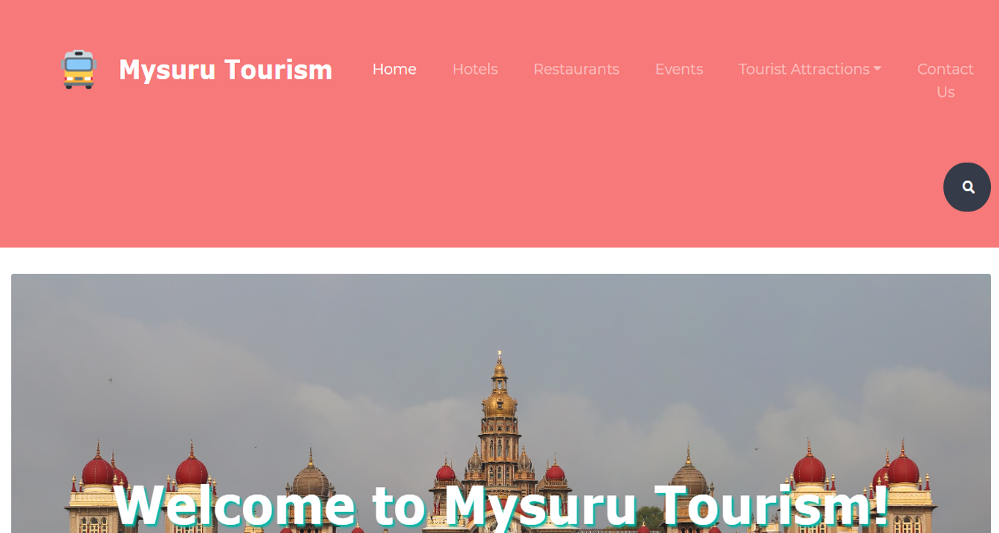
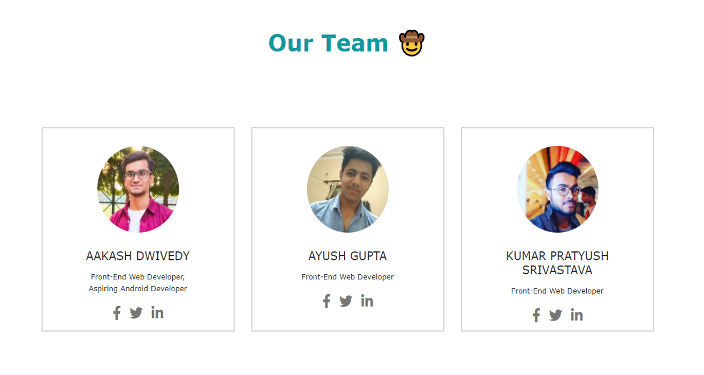

# DSCWOW-MysuruTourism

## Official repository of IECians team for DSC WOW's hackathon Code Off Duty.

### Visit website - [click here](https://dwivedyaakash.github.io/DSCWOW-MysuruTourism/)

### Project presentation - [see here](https://youtu.be/cjS6qA_Y2j0)

### See project on Devfolio - [click here](https://devfolio.co/submissions/mysuru-tourism-7)

 

### Website screenshot:

 

---

 

### Team members:
#### 1. Aakash Dwivedy - [LinkedIn](https://www.linkedin.com/in/dwivedyaakash/)
#### 2. Ayush Gupta - [GitHub](https://github.com/ayush-gupta-github)
#### 3. Kumar Pratyush Srivastava - [GitHub](https://github.com/kpratyush03)

